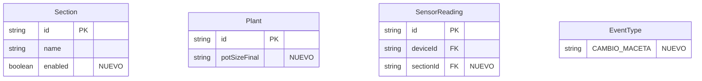

# Plan de Mejoras al Sistema de Cultivo

## 1. Visualizar Fotos de Eventos en Pagina de Carpa

**Problema**: En la pagina de carpa (`/sala/carpa/[id]`), al hacer click en una planta se muestran los ultimos 3 eventos. Cuando hay un evento de tipo FOTO, solo dice "Foto" pero NO muestra la imagen.

**Ubicacion del bug**: [`frontend/src/app/sala/carpa/[id]/page.tsx`](frontend/src/app/sala/carpa/[id]/page.tsx) lineas 1999-2056 - falta el caso para renderizar imagenes de eventos FOTO.

**Solucion**:

- Agregar bloque para `event.type === 'FOTO'` que renderice la imagen
- Incluir preview clickeable para ampliar (similar a seguimientos lineas 627-649)

---

## 2. Bug: "Click para ampliar" no funciona en Ciclos

**Problema**: En la pagina de ciclos/seguimientos, aparece "Click para ampliar" en las fotos pero no funciona correctamente.

**Solucion**:

- Revisar [`frontend/src/app/seguimientos/page.tsx`](frontend/src/app/seguimientos/page.tsx) linea 636
- Verificar que `event.data.url` tiene el valor correcto
- Opcion: usar modal de ampliacion en lugar de `window.open()` para mejor UX

---

## 3. Deshabilitar Carpas No en Uso

**Problema**: No hay forma de marcar una carpa como inactiva (ej: secadora vacia).

**Backend**:

- Agregar campo `enabled` (Boolean, default true) al modelo `Section` en [`backend/prisma/schema.prisma`](backend/prisma/schema.prisma)
- Actualizar DTOs en [`backend/src/modules/locations/dto/section.dto.ts`](backend/src/modules/locations/dto/section.dto.ts)
- Migrar base de datos

**Frontend**:

- Actualizar tipo `Section` en [`frontend/src/types/index.ts`](frontend/src/types/index.ts)
- Modificar [`frontend/src/components/CarpaCard.tsx`](frontend/src/components/CarpaCard.tsx) - estilo grisado + badge "Inactiva"
- Agregar toggle en pagina de detalle de carpa

---

## 4. Funcionalidad para Mudar Plantas

**Problema**: No hay UI clara para mover plantas entre secciones (el endpoint existe: `PATCH /plants/:id/move`).

**Solucion**:

- Agregar boton "Mudar" en [`frontend/src/components/PlantCard.tsx`](frontend/src/components/PlantCard.tsx)
- Crear modal de seleccion de destino con lista de secciones disponibles

---

## 5. Gestion de Macetas de Plantas

**Problema**: No hay informacion sobre tamano de maceta.

**Backend**:

- Agregar campo `potSizeFinal` (String opcional, ej: "11L") al modelo `Plant`
- Agregar `CAMBIO_MACETA` al enum `EventType`

**Frontend**:

- Mostrar tamano de maceta en `PlantCard`
- Agregar opcion "Cambio de Maceta" en modal de eventos con:
  - `previousPotSize`: tamano anterior
  - `newPotSize`: nuevo tamano
- El historial de cambios queda en los eventos

---

## 6. Reasignar Dispositivos con Historial Vinculado a Seccion

**Problema**: El historial de sensores esta vinculado a `deviceId`. Al reasignar, el historial debe quedarse en la seccion original.

**Backend**:

- Agregar campo `sectionId` al modelo `SensorReading` en schema.prisma
- Modificar [`backend/src/modules/devices/sensor-history.service.ts`](backend/src/modules/devices/sensor-history.service.ts) para guardar `sectionId`
- Crear endpoint `PATCH /devices/:id/reassign`

**Frontend**:

- Agregar opcion "Reasignar a otra carpa" en tarjeta de dispositivo
- Modal para seleccionar nueva seccion
- Advertencia: historial permanece en seccion actual

---

## Diagrama de Cambios en Base de Datos

## Orden de Implementacion

1. Fotos en eventos de carpa (frontend simple)
2. Bug ampliar foto en ciclos (frontend)
3. Deshabilitar carpas (migracion + UI)
4. Gestion de macetas (migracion + evento + UI)
5. Mudar plantas (UI, endpoint existe)
6. Reasignar dispositivos (migracion + logica historial)